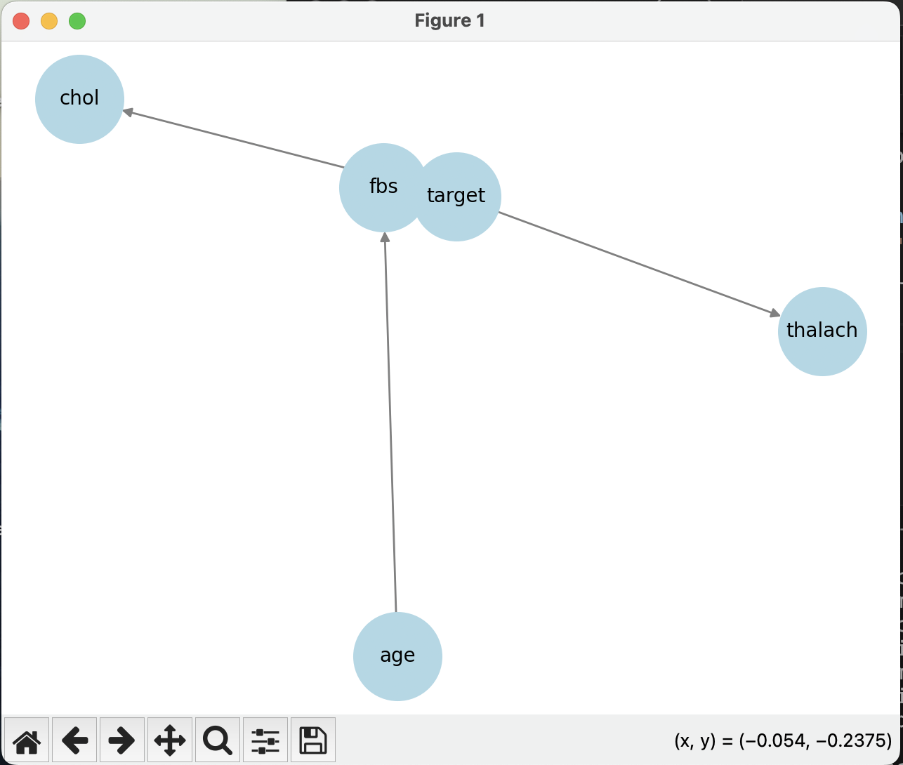
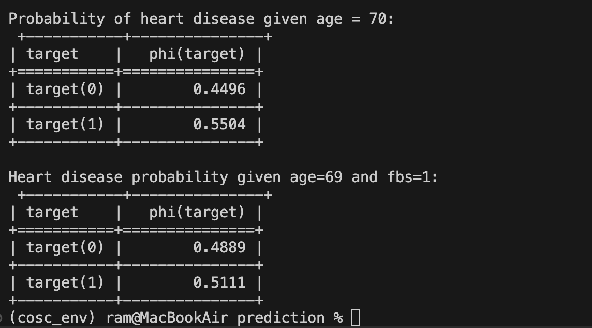

# Bayes to the Future: Predicting Heart Disease

This project is part of the COSC Hackweek Challenge and focuses on predicting the risk of heart disease using Bayesian Networks with the `pgmpy` library.

## Overview

- Cleaned and preprocessed the dataset (`heart_disease.csv`)
- Applied min-max normalization to numeric columns
- Built a Bayesian Network with predefined structure:
  ```
  age → fbs → target → chol, thalach
  ```
- Trained using Maximum Likelihood Estimation
- Performed inference to answer medical questions

## Setup

```bash
# Clone repo
git clone https://github.com/print-ramcharan/HackWeek_Challenge_Bayes_To_The_Future.git
cd HackWeek_Challenge_Bayes_To_The_Future

# Create virtual environment
python3 -m venv venv
source venv/bin/activate

# Install requirements
pip install -r requirements.txt
```

## Sample Inference

```bash
python clean_data.py

python model_training.py
```

Expected outputs:
- Probability of heart disease given age
- Cholesterol distribution given target
- Heart disease likelihood given age & fbs

## Files

- `clean_data.py` – handles data cleaning and normalization
- `model_training.py` – builds the Bayesian model and runs inference
- `heart_disease.csv` – input dataset

## Visualization

Visual representation of the Bayesian Network was created using The Bayesian Network structure learned from the data:


Test output:


